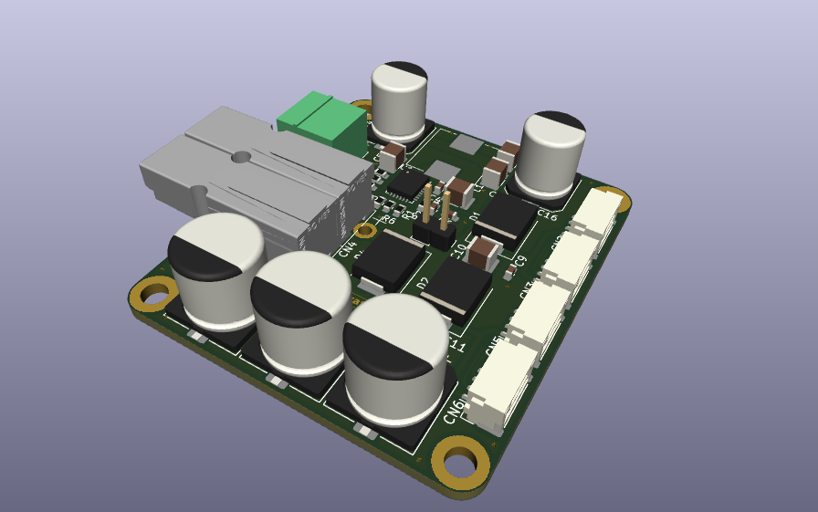
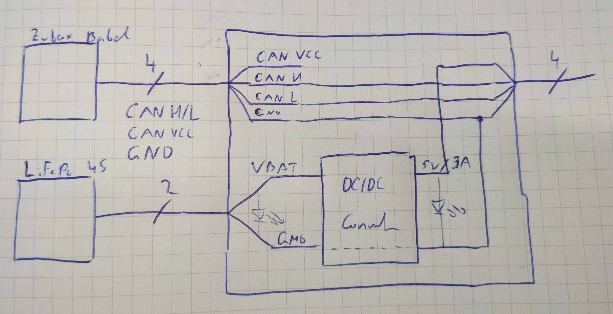
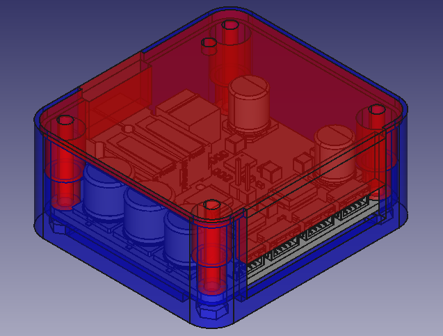
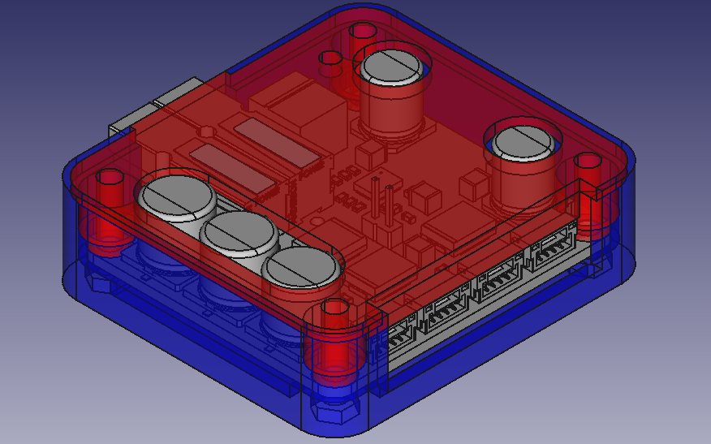
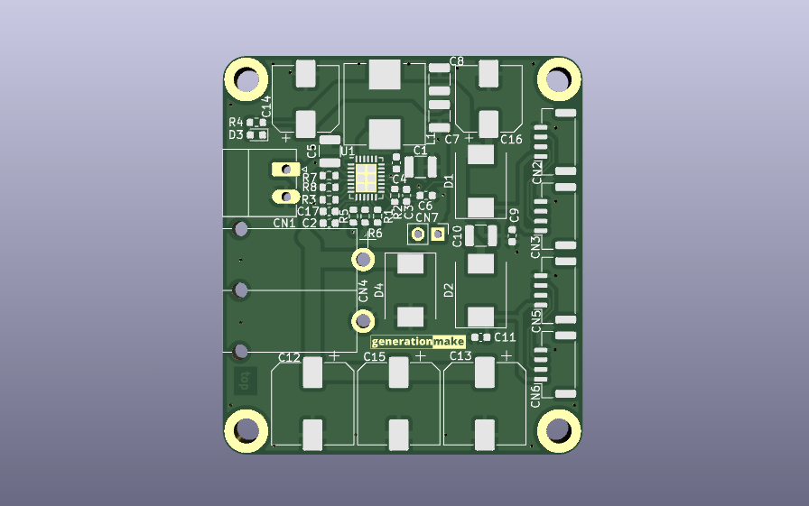
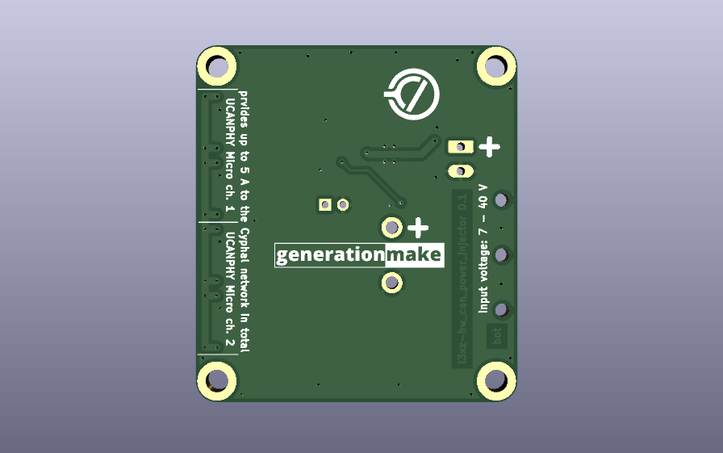

`CAN-Power-Injector`
====================

The purpose of this board is to inject 5V DC power at up to 5A for powering CAN bus devices.

  

  

#### Blockdiagram

  

#### Electrical Parameters
| Name | Value |
|-|-|
| V_IN min | 10.5 V | set by resistor divider(R7/R8) |
| V_IN max | 40.0 V | limited by TVS diode (D4) |
| V_CAN_OUT | 5.0 V to 5.5 V|
| I_CAN_OUT,CONTINUOUS | 5.0 A |

#### Inputs
| Designator | Name | Connector |
|-|-|-|
| CN4 | Battery (4S / 4100 mAh LiFePo) | [Powerpole® PP15 to PP45](https://www.andersonpower.com/content/dam/app/ecommerce/product-pdfs/PP-Pak/ds-pp1545.pdf) |
| CN1 | Battery | 3.5 mm screw terminal (not populated) |

#### Outputs
| Designator | Name | Connector |
|-|-|-|
| CN2 and CN3 | CAN channel 1 | JST GH 1.25mm 4-pin. |
| CN5 and CN6 | CAN channel 2 | JST GH 1.25mm 4-pin. |
| CN7 | 5V | 5V output, internal for testing (not populated) |

## Enclosure

There exists a 3D printable enclosure to encapsulate the PCB.

### Standard

  

### Low profile

  

## PCB
### Top

  

### Bottom

  

