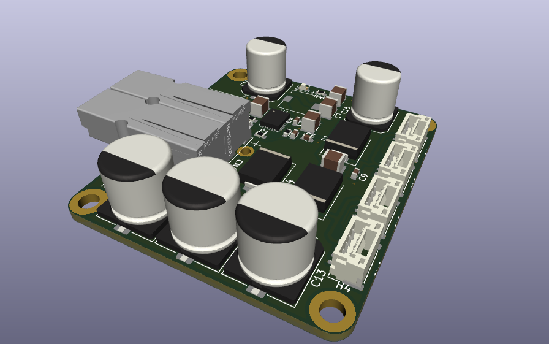
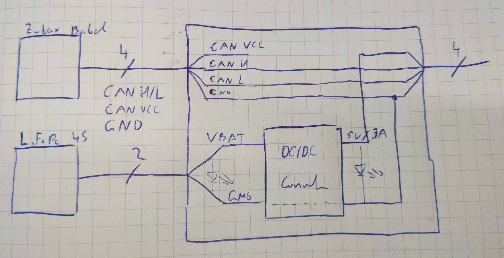
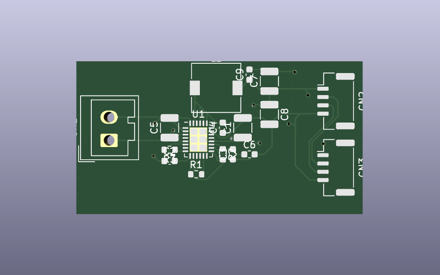
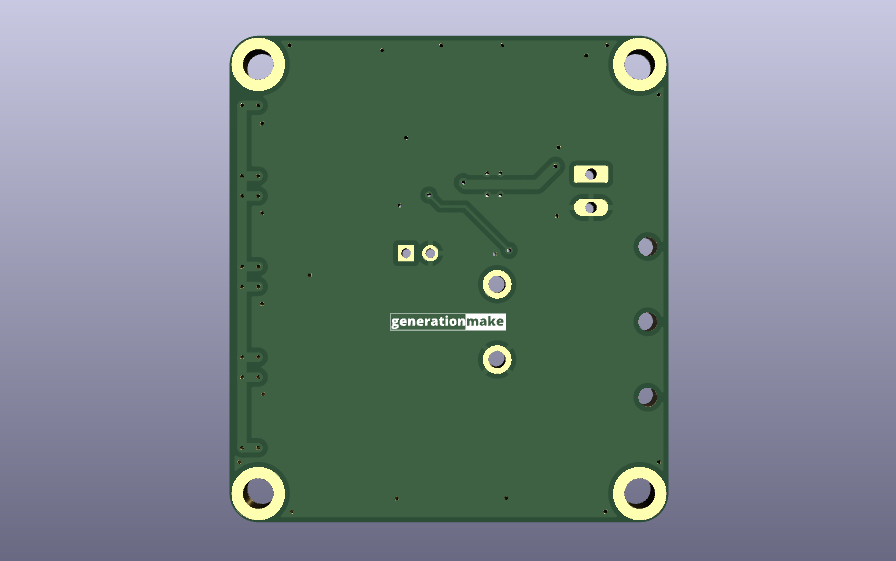

`l3xz-hw_can_power_injector`
============================
The purpose of this board is to provide 5V DC power to all connected CAN bus devices on the L3X-Z hexapod (except the Rasperry Pi).

  

#### Blockdiagram

  

#### Electrical Parameters
| Name | Value |
|-|-|
| V_IN min | 10.5 V | set by resistor devider(R7/R8) |
| V_IN max | 40.0 V | limited by TVS diode (D4) |
| V_CAN_OUT | 5.0 V |
| I_CAN_OUT,CONTINOUS | 3.0 A |

#### Inputs
| Name | Connector |
|-|-|
| Battery (4S / 4100 mAh LiFePo) | [Powerpole® PP15 to PP45](https://www.andersonpower.com/content/dam/app/ecommerce/product-pdfs/PP-Pak/ds-pp1545.pdf) |
| CAN | JST GH 1.25mm 4-pin. |

#### Outputs
| Name | Connector |
|-|-|
| CAN | JST GH 1.25mm 4-pin. |

## PCB

### Top

### Bottom

